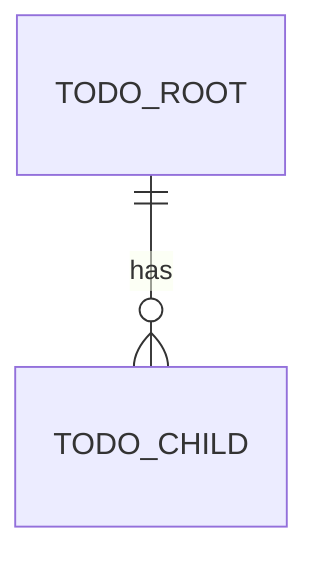

# Domain model

> **Skeleton.** Copy into an application's `docs/architecture/` and fill in. It lists the
> entities, their relationships and the rules that must always hold. The vocabulary is
> defined in the glossary, and the behaviour in the requirements.

## Entities

## Aggregates

| Aggregate | Root | Contains | Why this boundary |
|---|---|---|---|
| TODO | | | |

## Invariants

Numbered, so code and tests can reference them. Each one is enforced in a constructor or
a `Create` factory; see
[../guidelines/domain-modelling.md](../guidelines/domain-modelling.md).

- **INV-1:** TODO
