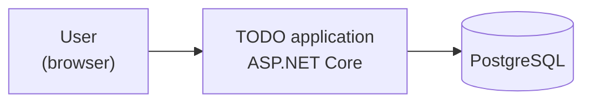

# Architecture overview

> **Skeleton.** Copy into an application's `docs/architecture/` and fill in the TODOs.
> This document describes how the system is built **today**. When something changes, it
> changes with it. It is not a history. Reasoning lives in [../adr/](../adr/), and the
> rules contributors follow live in
> [../guidelines/architecture-principles.md](../guidelines/architecture-principles.md).

## Context



TODO: list the external systems, or state that there are none, and whether that is a
requirement.

## Technology

|   Concern   |                                       Choice                                        |
|-------------|-------------------------------------------------------------------------------------|
| Language    | C# on .NET 10                                                                       |
| Web         | ASP.NET Core minimal APIs, JSON, ProblemDetails errors                              |
| Persistence | EF Core with Npgsql, in `App.Adapters.Persistence`                                  |
| Schema      | EF Core migrations, applied by `App migrate` before the app starts                  |
| Database    | PostgreSQL                                                                           |
| Build       | `dotnet` solution: `App.Core`, `App.Adapters.Web`, `App.Adapters.Persistence`, `App.Host` |
| Tests       | xUnit v3, AwesomeAssertions, ArchUnitNET, Testcontainers for PostgreSQL             |
| Formatting  | CSharpier; `dotnet format` for analyzers only                                       |

## Shape: a hexagon per feature slice

The application is **ports and adapters**
([ADR-0001](../adr/0001-hexagonal-architecture-with-use-case-slices.md)). The domain is
plain C# with no framework dependencies. Command and query handlers orchestrate it behind
inbound ports, and adapters implement outbound ports. The build enforces the dependency
rule: `App.Core` has no ASP.NET Core or EF Core on its dependency graph
([ADR-0005](../adr/0005-adapters-as-separate-projects.md)).

## Slices

TODO: one line per slice, marking the ones not built yet.

```
App.Core
├── TODO         what it covers
└── Common       Money, DomainException, shared value objects
```

## Derived values

TODO: which values are computed on read and never stored, and why.

## Not yet decided

TODO: each open question becomes an ADR once settled.
