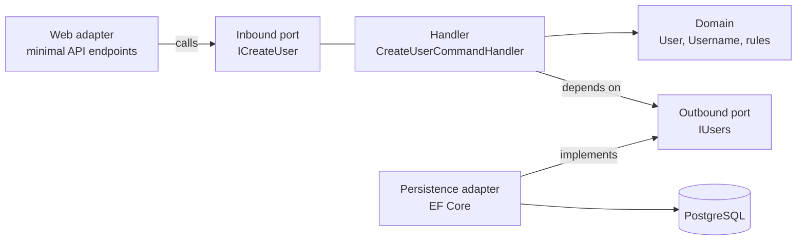

# Architecture principles

How we structure code. The four commitments below are deliberate and apply to every
feature. Everything else in this document follows from them.

1. **Hexagonal architecture (ports and adapters).** The domain sits in the middle and
   knows nothing about HTTP, EF Core or ASP.NET Core. Everything technical plugs into it.
2. **Domain-Driven Design.** The model uses the words in the project's glossary, and
   business rules live in the domain objects, not in services that push data around.
3. **SOLID.** See [§5](#5-solid-applied-here) for what each letter means *here*.
4. **Use-case-driven slicing.** The application layer is a set of named commands and
   queries, each with its own handler (`CreateUserCommandHandler`,
   `RecordDepositCommandHandler`). It is not a set of generic `AccountService` classes that
   accumulate every operation touching an account.

## 1. The dependency rule

Dependencies point **inward only**. The domain depends on nothing. Handlers depend on the
domain. Adapters depend on the ports. Nothing inside ever references anything outside.



Concretely, in `Domain`, `Commands`, `Queries` and `Ports` you will not find:
`Microsoft.EntityFrameworkCore`, `DbContext`, EF attributes (`[Key]`, `[Table]`,
`[Column]`), `Microsoft.AspNetCore.*`, `HttpContext`, `IResult`, `System.Text.Json`
attributes, or SQL. There is no exception, not even for transactions (see
[§6](#6-practices)).

The build enforces inward-only. `App.Core` has no ASP.NET Core framework reference and no
EF Core or Npgsql package, so it cannot see them at all
([ADR-0005](../adr/0005-adapters-as-separate-projects.md)). The compiler cannot see slice
isolation, `Hydrate`, or whether handlers implement a port. ArchUnitNET tests cover those;
see [testing-strategy.md](testing-strategy.md).

## 2. Solution and namespace structure

Slice by **feature first**, then by hexagon layer. Everything about one concept lives
together, and each slice has the same internal shape:

```
App.Core
├── Users
│   ├── Domain                 User, Username, UserId, invariants
│   ├── Commands               CreateUserCommand + CreateUserCommandHandler
│   ├── Queries                GetUserQuery + GetUserQueryHandler, read models
│   └── Ports
│       ├── In                 ICreateUser, IGetUser   (interfaces the handlers implement)
│       └── Out                IUsers                  (interfaces the adapters implement)
├── Accounts
├── Goals
└── Common
    └── Domain                 Money, DomainException, shared value objects
```

Folders and namespaces match: `App.Core.Users.Commands`. The slices live in the
**`App.Core` project**. Adapters live in projects of their own that reference it
([ADR-0005](../adr/0005-adapters-as-separate-projects.md)):

```
src/App.Core                    the slices above. No ASP.NET Core, no EF Core
src/App.Adapters.Web            minimal API endpoint groups, request/response DTOs  → Core
src/App.Adapters.Persistence    DbContext, EF entities, mappers, migrations         → Core
src/App.Host                    Program.cs, configuration, DI wiring, `migrate`     → all
```

`App.Core` has no framework to reference, so the dependency rule is a **compile error**
rather than a convention. A domain class cannot use `DbContext` even by accident.

Rules:

- A slice may depend on **another slice's inbound ports only**. It never depends on
  another slice's domain, handlers or persistence. Cross-slice access goes through a port
  like any other collaborator.
- Types are **`internal` by default**. Only ports, commands, queries, results, and domain
  types that another project or slice legitimately needs are `public`. Handlers are
  `public` only because the composition root in `App.Host` registers them (see the open
  decision in [§8](#8-decisions-still-open)).
- `Common` holds genuinely shared types and mirrors the same internal shape
  (`Common/Domain`). If only one slice uses something, it belongs to that slice. `Common`
  is not a junk drawer.

## 3. Commands, queries and their handlers

**One operation = one command or query = one handler = one public method.** This is the
heart of the slicing commitment: the type names in `Commands/` and `Queries/` are the list
of things the application can do, readable at a glance.

Writes live in `Commands/`, reads in `Queries/`. Each handler implements a small inbound
port, so adapters and other slices depend on an interface rather than on the handler.

```csharp
// Ports/In: what the outside world may ask for
public interface IRecordDeposit
{
    Task<TransactionId> HandleAsync(RecordDepositCommand command, CancellationToken ct);
}

// Commands: the input, validated where it is defined
public sealed record RecordDepositCommand
{
    public RecordDepositCommand(
        AccountId accountId, UserId requestedBy, Money amount, DateOnly occurredOn, string? note)
    {
        ArgumentNullException.ThrowIfNull(accountId);
        ArgumentNullException.ThrowIfNull(requestedBy);
        ArgumentNullException.ThrowIfNull(amount);
        if (!amount.IsPositive)
            throw new ArgumentException("amount must be positive", nameof(amount));

        AccountId = accountId;
        RequestedBy = requestedBy;
        Amount = amount;
        OccurredOn = occurredOn;
        Note = note;
    }

    public AccountId AccountId { get; }
    public UserId RequestedBy { get; }
    public Money Amount { get; }
    public DateOnly OccurredOn { get; }
    public string? Note { get; }
}

// Commands: the orchestration, and only the orchestration
public sealed class RecordDepositCommandHandler(
    IAccounts accounts,          // outbound port
    ITransactions transactions,  // outbound port
    IUnitOfWork unitOfWork)      // outbound port: the transaction boundary
    : IRecordDeposit
{
    public async Task<TransactionId> HandleAsync(RecordDepositCommand command, CancellationToken ct)
    {
        var account = await accounts.ByIdAsync(command.AccountId, ct)
            ?? throw new AccountNotFound(command.AccountId);

        account.AssertOwnedBy(command.RequestedBy);   // authorization is a domain rule
        var deposit = account.Deposit(command.Amount, command.OccurredOn, command.Note);

        transactions.Add(deposit);
        await unitOfWork.CommitAsync(ct);
        return deposit.Id;
    }
}
```

The command's properties are get-only, not `init`. That way a `with` expression cannot
produce an instance that skipped the constructor's validation.

Conventions:

- Name the operation after **what the user does**, in the imperative: `RecordDeposit`,
  `ArchiveAccount`, `InviteMemberToGroup`. Never `AccountManagementService`.
- The inbound port carries that name with the .NET interface prefix. The command and
  handler add the suffix: `IRecordDeposit` / `RecordDepositCommand` /
  `RecordDepositCommandHandler`. Queries follow the same shape: `IGetUser` /
  `GetUserQuery` / `GetUserQueryHandler`.
- The single public method is `HandleAsync(command, CancellationToken)`. It is async
  because the ports behind it do I/O. The token is always passed through.
- Commands and queries are records, validated in their constructor. Output is a plain
  record or an identifier. It is never an EF entity, and never a DTO shaped for one
  screen.
- The handler **orchestrates**: load, delegate to the domain, save. A business rule that
  is visible in a handler's code usually belongs in an aggregate instead.
- Query handlers may bypass the domain and return read models straight from a query port.
  This is intentional (CQRS-lite): it keeps read-heavy screens fast without distorting the
  model. Commands never take that shortcut.

## 4. Ports

|                |                  Inbound (driving)                   |                     Outbound (driven)                     |
|----------------|------------------------------------------------------|-----------------------------------------------------------|
| Who calls      | Web adapter, background jobs, other slices, tests    | The handler                                               |
| Who implements | The command or query handler                         | Persistence adapter, the host, fakes in tests             |
| Lives in       | `<Slice>/Ports/In`                                   | `<Slice>/Ports/Out`                                       |
| Named after    | The action: `IRecordDeposit`                         | The need, in domain terms: `IAccounts`, `ITransactions`   |

- The **inside** owns the ports. An outbound port describes what the domain needs, in the
  domain's language, not what EF Core offers: `IAccounts.ByIdAsync(...)`, not
  `DbSet<AccountEntity>.FindAsync(...)`.
- Keep ports **narrow** (Interface Segregation). A handler that only reads accounts should
  not be able to delete them. Several small ports beat one repository interface with
  twenty methods.
- Ports take and return **domain types**, never persistence entities and never
  `IQueryable`. An `IQueryable` crossing a port lets the caller write SQL through the
  domain's back door.
- Time is not a custom port. Use .NET's `TimeProvider`, which is already an abstraction
  and needs no package.

Aggregates, value objects, invariants and the `Create`/`Hydrate` split are covered in
[domain-modelling.md](domain-modelling.md).

## 5. SOLID applied here

|                           |                                                             Meaning in this codebase                                                              |
|---------------------------|---------------------------------------------------------------------------------------------------------------------------------------------------|
| **S**ingle responsibility | One handler does one thing. A type that needs "and" in its description is two types.                                                              |
| **O**pen/closed           | New behaviour arrives as a new handler or a new adapter, not as another `if` branch in an existing one.                                           |
| **L**iskov substitution   | Any adapter implementing a port must honour its contract, including a fake used in tests. If the fake needs to lie, the port is wrong.            |
| **I**nterface segregation | Narrow ports (§4). No "God repository": `IUsers` grows a method only when a handler needs it.                                                     |
| **D**ependency inversion  | The inside defines the interfaces; the outside implements them. This *is* the hexagon. DIP is the principle the whole architecture rests on.      |

## 6. Practices

- **Constructor injection only.** Primary constructors for handlers and adapters are fine.
  No service locator, no `IServiceProvider` parameters, no property injection. Domain
  types and handlers must be constructible in a test with `new`.
- **The composition root is `App.Host`.** Handlers and adapters are registered there,
  explicitly, one line each. `App.Core` does not reference the DI abstractions to register
  itself. (Whether it should is **postponed**. See [§8](#8-decisions-still-open). Match
  the existing slices rather than choosing anew.)
- **The transaction boundary is the handler.** It is expressed through an `IUnitOfWork`
  outbound port, which the persistence adapter implements over
  `DbContext.SaveChangesAsync`. There is no attribute and no ambient transaction. Unlike
  the Java original, where `@Transactional` was a tolerated exception, .NET needs no
  exception here.
- **Immutability by default.** Records for commands, results and value objects. Mutable
  state only inside aggregates, behind `private set`, and only where the domain genuinely
  changes.
- **Validation twice, for different reasons.** The web adapter rejects malformed input
  (missing field, unparseable date) with a 400. The domain rejects invalid *business*
  states (a deposit on an archived account). Neither replaces the other.
- **Time is injected.** Never call `DateTime.Now`, `DateTimeOffset.UtcNow` or
  `DateOnly.FromDateTime(DateTime.Today)` in domain or handler code. Inject `TimeProvider`.
  Period-boundary bugs are otherwise untestable.
- **The domain has no EF Core.** Aggregates are plain C#. Separate EF entities live in the
  persistence adapter ([ADR-0002](../adr/0002-domain-free-of-ef-core.md)). Domain objects
  are not change-tracked, so a handler explicitly adds or updates what it changed.
- **Mapping is explicit.** Hand-written mappers between EF entities and domain objects. No
  mapping library, and no class doing double duty. Mappers use `Hydrate` on the way in and
  read state on the way out.
- **Derived values are computed, not stored.** An application states which values are
  derived in its [architecture overview](../architecture/overview.md).
- **Money never touches `double` or `float`.** `Money` is a `decimal` amount plus a
  currency, and only `Money` crosses layer boundaries.
- **Don't abstract on speculation.** A port with exactly one implementation and no test
  fake is often just indirection. Add the seam when a second reason to change appears.

## 7. Smells we reject

- `*Service` classes that grow one method per endpoint
- A handler with more than one public method, or a command reused by two handlers
- EF entities used as domain objects, DTOs, or API responses
- `IQueryable`, `DbSet` or `DbContext` outside the persistence adapter
- Returning `null` where the port's signature does not say `T?`
- Business rules inside endpoints, mappers, EF configurations or database queries
- Static access to the current time, user or transaction (`DateTime.Now`,
  `HttpContext.Current`-style ambient state)
- `Common`, `Shared` or `Utils` projects that everything depends on
- Comments explaining what code does instead of naming things properly

## 8. Decisions still open

- **TODO: handler registration. Postponed deliberately.** There are two options. Explicit
  registration in `App.Host` keeps `App.Core` free of every package, but forces handlers
  to be `public`. An `AddCore(IServiceCollection)` extension in `App.Core` needs
  `Microsoft.Extensions.DependencyInjection.Abstractions`, but lets handlers stay
  `internal`. Until this is decided, follow what the existing slices do and do not
  introduce a third way. Revisit once the first few slices exist. It is listed under
  *Postponed* in [../adr/](../adr/).
- **TODO: read models.** How far to take the CQRS-lite escape hatch in §3 before it needs
  its own structure.
- **TODO: slice isolation.** Keeping technology out of `App.Core` is settled by
  [ADR-0005](../adr/0005-adapters-as-separate-projects.md). Slices policing *each other*
  inside `App.Core` is not. For now that is ArchUnitNET only. The alternative is one
  project per slice, which multiplies projects.
